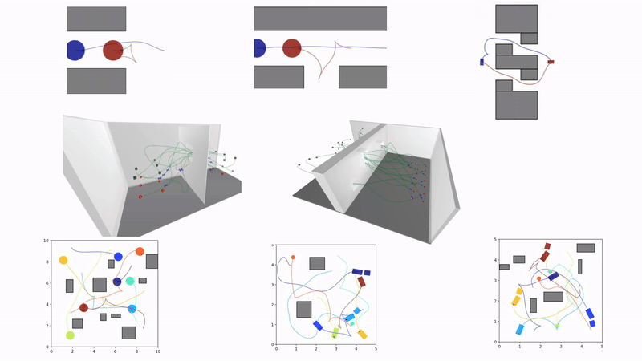

# Interaction-Aware Multi-Robot Kinodynamic Motion Planning
This work presents a kinodynamic motion planner for a heterogeneous team of robots that respects robot dynamics and directly reasons about interaction forces between aerial robots operating in close-proximity.
Our method, Discontinuity-Bounded Enhanced Conflict-Based Search (db-ECBS), generalizes the multi-agent path finding method Enhanced Conflict-Based Search to the continuous domain by using the single-robot kinodynamic motion planner discontinuity-bounded A*. 
Db-ECBS operates on three levels. Initially, individual robot trajectories are computed using a graph search that allows bounded discontinuities between precomputed motion primitives. The second level identifies inter-robot collisions, interaction force violations and resolves them by imposing constraints on the first level. 
The third and final level uses the resulting solution with discontinuities as an initial guess for a joint space trajectory optimization. The procedure is repeated with a reduced discontinuity bound resulting in a anytime, probabilistically complete, and asymptotically bounded suboptimal planner.

Paper on [arXiv]() and [Video](https://www.youtube.com/watch?v=OcG-59Pq3oY) are available.  





## Robot dynamics 

* Unicycle 
* Unicycle ($2^{\text{nd}}$ order)
* Double integrator 2D
* Double integrator 3D
* Car with trailer

## Get primitives

The primitives are on the TUB cloud, download a copy

```
wget https://tubcloud.tu-berlin.de/s/wezMej9ieNjwjz6/download
unzip download
rm download
```

## Building

Tested on Ubuntu 22.04.

```
mkdir buildRelease
cd buildRelease
cmake -DCMAKE_BUILD_TYPE=Release -DCMAKE_PREFIX_PATH="/opt/openrobots/" ..
make -j
```

## Running

```
cd buildRelease
python3 ../scripts/benchmark.py
```
## Enable/Disable Interaction-Awareness
```
gedit example/algorithms.yaml
db-ecbs/default/residual_force = False
```
